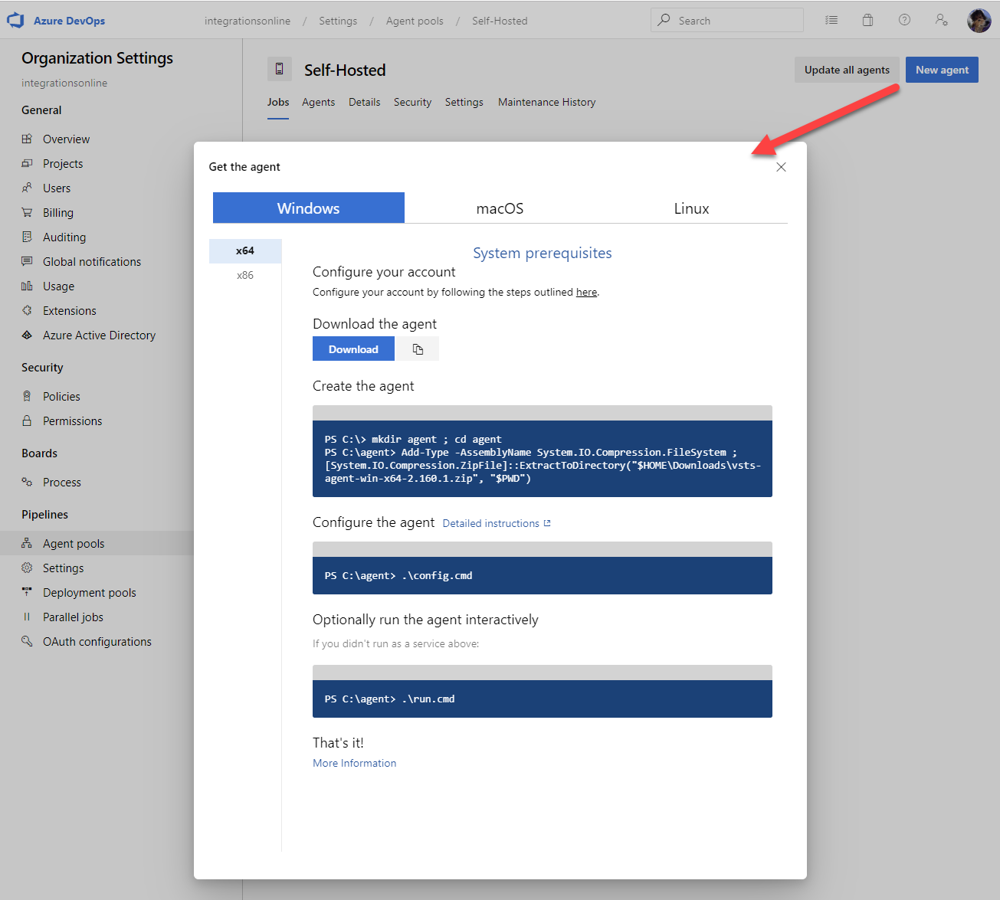

# Implement & Manage Build Infrastructure

## Build Pipelines

[YAML Schema Reference](https://docs.microsoft.com/en-us/azure/devops/pipelines/yaml-schema?view=azure-devops&tabs=schema)

[Azure DevOps Pipelines - VS Code Extensions](https://marketplace.visualstudio.com/items?itemName=ms-azure-devops.azure-pipelines)

## Configure Self Hosted Build Agents

[Self-hosted Windows Agents](https://docs.microsoft.com/en-us/azure/devops/pipelines/agents/v2-windows?view=azure-devops)

[Github: Azure Pipelines Agent](https://github.com/microsoft/azure-pipelines-agent)

### Setup Self hosted Agents

Check HostOS & Prerequesites for a Windows Host

```
$hostname = Get-CimInstance Win32_ComputerSystem | Select-Object Caption
$osversion = Get-CimInstance Win32_OperatingSystem | Select-Object Caption
$org = "integrationsonline"
$uri = "https://dev.azure.com/$org"
Invoke-WebRequest -Uri $uri | Select-Object StatusCode
```

Download Agent using the Download Button, extract it to a folder



> Note: When configuring the agent make sure you run the PowerShell as Administrator to be able to start the agent as service

```
cd \
mkdir dev-ops-agent;
cd dev-ops-agent;
Add-Type -AssemblyName System.IO.Compression.FileSystem ; [System.IO.Compression.ZipFile]::ExtractToDirectory("$HOME\Downloads\vsts-agent-win-x64-2.160.1.zip", "$PWD")
```

# Lab

[Lab - Integrate Jenkins with Azure Pipelines](https://www.azuredevopslabs.com/labs/vstsextend/jenkins/)

[Lab -Integrate Your GitHub Projects With Azure Pipelines](https://www.azuredevopslabs.com/labs/azuredevops/github-integration/)

[Lab - Deploying a Multi-Container Application](https://azuredevopslabs.com/labs/vstsextend/kubernetes/)
